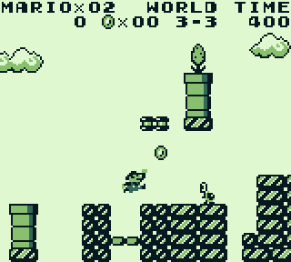

# gbdotnet

A Game Boy emulator written in .NET Core using [MonoGame](http://www.monogame.net/) as a frontend.

 

## Running

```cmd
cd .\GBDotNet.MonoGame\
dotnet run rom.gb
```

Additional settings can be specified in `appsettings.json`.

## Features

* Trace logging
* MBC1 memory mapper
* [TODO + work in progress](https://github.com/taylus/gbdotnet/projects/1)

## Controls

* Arrow keys = D-pad
* <kbd>X</kbd> = A
* <kbd>Z</kbd> = B
* <kbd>Enter</kbd> = Start
* <kbd>Right Shift</kbd> = Select
* <kbd>Esc</kbd> = Exit

### Debug

* <kbd>Tab</kbd> = Speed toggle
* <kbd>Space</kbd> = Show screen layer
* <kbd>T</kbd> = Show tile layer
* <kbd>B</kbd> = Show background layer
* <kbd>W</kbd> = Show window layer
* <kbd>S</kbd> = Show sprite layer
* <kbd>F1</kbd> = Core dump
* <kbd>F2</kbd> = Restart

## [Blargg's test ROMs](https://github.com/retrio/gb-test-roms)

   
